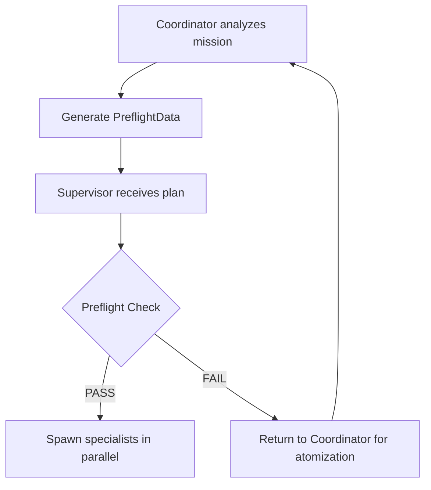

# 🛫 DUMBAI Preflight Gates

## Purpose
Prevent scope creep and ensure atomic task boundaries BEFORE spawning any specialist.

## When to Use
- **Supervisor**: MANDATORY before spawning ANY specialist
- **Coordinator**: MUST generate preflight data with every recommendation
- **Timing**: After Coordinator analysis, before Specialist spawn

## Phase-Specific Preflight Checklists

### 📐 CONTRACT Phase
- [ ] Each specialist creates ≤ 2 schema/type files
- [ ] Schema files have explicit names (e.g., `UserSchema.ts`)
- [ ] Scope: "ONLY define types/schemas for X"
- [ ] No implementation logic allowed
- [ ] Zod schemas or TypeScript interfaces only
- [ ] Line limit: ≤100 lines (schemas are concise)

### 🏗️ STUB Phase
- [ ] Each specialist stubs ≤ 2 implementation files
- [ ] File names match CONTRACT definitions
- [ ] Scope: "ONLY create function signatures with NotImplementedError"
- [ ] Must include `@todo[STUB]` tags
- [ ] No actual implementation allowed
- [ ] Line limit: ≤150 lines (signatures + errors only)

### 🧪 TEST Phase (Most Complex)
- [ ] Each specialist creates EXACTLY 1 test file
- [ ] Test file name explicit (e.g., `auth-login.test.ts`)
- [ ] Scope: "ONLY test [specific aspect]"
- [ ] Test type specified (unit OR integration OR performance, not mixed)
- [ ] Must be skipped initially with `@blocked-by` tags
- [ ] Line limit: ≤150 lines per file
- [ ] **Multiple specialists for comprehensive coverage**

### 💻 IMPLEMENT Phase
- [ ] Each specialist implements ≤ 2 files
- [ ] Files match STUB phase files
- [ ] Scope: "ONLY implement [specific functions]"
- [ ] Must remove `@todo[STUB]` tags
- [ ] Cannot modify contracts or tests
- [ ] Line limit: ≤150 lines of implementation
- [ ] Dependencies between implementations identified

### Common Criteria (ALL Phases)

#### 1. Atomicity Enforcement
- [ ] Single responsibility per specialist
- [ ] Explicit file names, no patterns or globs
- [ ] Line limits appropriate for phase

#### 2. Scope Boundaries
- [ ] Scope contains "ONLY" keyword
- [ ] "Allowed" section phase-appropriate
- [ ] "Not Allowed" section prevents scope creep
- [ ] No vague terms: "comprehensive", "complete", "all", "full"

#### 3. Parallel Execution Ready
- [ ] Multiple specialists when extensive work needed
- [ ] Non-overlapping file scopes
- [ ] Dependencies identified

### ❌ FAIL Criteria (ANY of these = FAIL)

#### Automatic Failures
- Directory paths instead of files (e.g., `test/` instead of `test/auth.test.ts`)
- Pattern matching in filenames (e.g., `*.test.ts`)
- "Comprehensive" or similar broad terms in scope
- More than 2 files per specialist
- No line limits specified
- Overlapping file assignments between parallel specialists

## Preflight Data Structure

```typescript
interface PreflightData {
  // Generated by Coordinator
  missionId: string;
  phase: 'CONTRACT' | 'STUB' | 'TEST' | 'IMPLEMENT';

  specialists: {
    id: string;
    type: 'implementation_specialist' | 'test_writer_specialist' | etc;
    files: string[];        // MUST be ≤2, prefer 1
    lineLimit: number;      // MUST be ≤150
    scope: string;          // MUST contain "ONLY"
    allowed: string[];      // Explicit list of what CAN be done
    notAllowed: string[];   // Explicit list of what CANNOT be done
    dependencies: string[]; // Other specialist IDs that must complete first
  }[];

  coverage: {
    goal: string;           // e.g., "Comprehensive test coverage"
    totalFiles: number;     // Sum of all specialist files
    totalLines: number;     // Estimated total output
    strategy: string;       // How atomicity achieves the goal
  };

  validation: {
    atomicity: 'PASS' | 'FAIL';
    boundaries: 'PASS' | 'FAIL';
    parallelizable: 'PASS' | 'FAIL';
  };
}
```

## Examples

### ❌ FAIL Example - Too Broad
```yaml
PREFLIGHT-CHECK: FAIL

Mission: implement-output-processor-tests
Phase: TEST

Specialist-1:
  type: test_writer_specialist
  files: ["test/"]  # ❌ Directory not files
  scope: "Create comprehensive test suite"  # ❌ Vague
  lineLimit: null  # ❌ No limit

Failure Reasons:
- Directory path instead of specific files
- "Comprehensive" is not atomic
- No line limits
- Single specialist for broad scope

Action Required: Return to Coordinator for decomposition
```

### ✅ PASS Example - Properly Atomized
```yaml
PREFLIGHT-CHECK: PASS

Mission: implement-output-processor-tests
Phase: TEST

Specialist-1:
  type: test_writer_specialist
  files: ["output-processor.test.ts"]
  scope: "ONLY create core parsing unit tests"
  lineLimit: 150
  allowed: ["Basic parse() function tests", "Input validation tests"]
  notAllowed: ["Integration tests", "Performance tests", "Other files"]

Specialist-2:
  type: test_writer_specialist
  files: ["output-processor-edge.test.ts"]
  scope: "ONLY create edge case tests"
  lineLimit: 150
  allowed: ["Malformed input tests", "Boundary condition tests"]
  notAllowed: ["Core functionality", "Performance tests", "Other files"]

Specialist-3:
  type: test_writer_specialist
  files: ["output-processor-errors.test.ts"]
  scope: "ONLY create error handling tests"
  lineLimit: 150
  allowed: ["Error throw tests", "Error recovery tests"]
  notAllowed: ["Happy path tests", "Performance tests", "Other files"]

Coverage:
  goal: "Comprehensive test coverage for output processor"
  totalFiles: 3
  totalLines: 450
  strategy: "3 parallel specialists, each handling specific aspect"

Validation: ALL PASS
Result: Ready to spawn 3 specialists in parallel
```

## Achieving Comprehensive Coverage

The key insight: **COMPREHENSIVE = MANY ATOMIC TASKS**

### Pattern for Extensive Test Suites
```yaml
# Want 1000+ lines of tests? Use 7-8 specialists:

Specialists for Core Tests:
- specialist-1: auth-login.test.ts (150 lines)
- specialist-2: auth-logout.test.ts (150 lines)
- specialist-3: auth-session.test.ts (150 lines)

Specialists for Edge Cases:
- specialist-4: auth-edge-cases.test.ts (150 lines)
- specialist-5: auth-error-cases.test.ts (150 lines)

Specialists for Integration:
- specialist-6: auth-api-integration.test.ts (150 lines)
- specialist-7: auth-db-integration.test.ts (150 lines)

Specialist for Test Data:
- specialist-8: fixtures/auth-test-data.ts (150 lines)

Total: 8 files × 150 lines = 1200 lines of comprehensive tests!
```

## Supervisor Self-Check Algorithm

```typescript
function supervisorPreflightCheck(briefing: TaskBriefing): PreflightResult {
  const redFlags = [
    /comprehensive.*suite/i,
    /all tests/i,
    /complete coverage/i,
    /entire.*directory/i,
    /multiple.*files/i
  ];

  // Check for red flags
  if (redFlags.some(flag => briefing.scope.match(flag))) {
    return {
      status: 'FAIL',
      reason: 'Scope too broad - contains vague terms',
      action: 'Request Coordinator to atomize into multiple specialists'
    };
  }

  // Check file count
  if (briefing.files.length > 2) {
    return {
      status: 'FAIL',
      reason: 'Too many files per specialist',
      action: 'Split into multiple specialists, max 2 files each'
    };
  }

  // Check for ONLY keyword
  if (!briefing.scope.includes('ONLY')) {
    return {
      status: 'FAIL',
      reason: 'Scope not bounded with ONLY keyword',
      action: 'Add ONLY to explicitly limit scope'
    };
  }

  return { status: 'PASS', proceed: true };
}
```

## Integration with DUMBAI Flow



## Critical Rules

1. **NEVER bypass preflight** - It's mandatory, not optional
2. **FAIL = STOP** - Don't try to "fix" a failed preflight, return to Coordinator
3. **Document the check** - Include PREFLIGHT-CHECK status in spawn decision
4. **Atomicity over convenience** - Better to spawn 10 specialists than 1 broad one
5. **Parallel is the goal** - Multiple atomic tasks enable parallel execution

## Remember

The goal is STILL comprehensive coverage - we just achieve it through:
- Multiple specialists instead of one
- Atomic tasks instead of broad scopes
- Parallel execution instead of sequential
- Explicit boundaries instead of implicit understanding

**Formula**: Comprehensive Coverage = Many Atomic Tasks × Parallel Execution