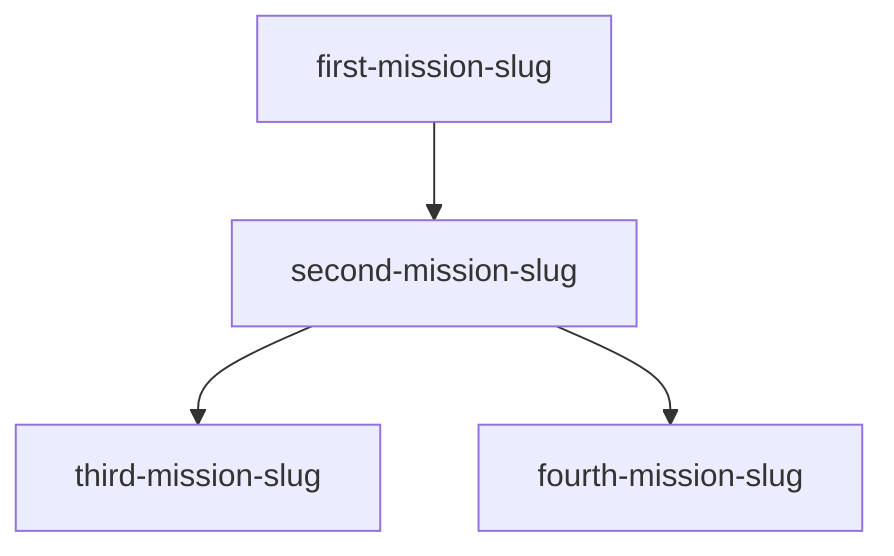

# Request: {Clear, Descriptive Title}

## Original Request
"{Exact user request, quoted}"

## Breaking Changes Policy
- **User Requirement**: {REQUIRED|NOT_REQUIRED|NOT_SPECIFIED}
- **Applied To**: {All missions|Specific missions: [list]}
- **Decision Date**: {YYYY-MM-DD HH:MM}
- **Rationale**: {Why this decision was made}

## Current Scope
- ✅ {What's definitively included}
- ⚠️ {What expanded beyond original request}
- 🔄 {What's currently in progress}

## Outcomes
- [ ] {Specific, measurable outcome 1}
- [ ] {Specific, measurable outcome 2}
- [ ] {Specific, measurable outcome 3}

## Scope Changes
- {YYYY-MM-DD HH:MM}: {Brief description} [reason: {concise explanation}]
- {YYYY-MM-DD HH:MM}: {Another change} [reason: {why needed}]

## Decision Log
- {Decision made} [approved: user|auto]
- {Option deferred} [reason: {brief explanation}]

## Mission Dependency Graph

## Current Missions
| Mission               | Status        | Compatibility | Blocked By          | Blocks (derived)              |
|-----------------------|---------------|---------------|---------------------|-------------------------------|
| first-mission-slug    | ✅ completed  | NOT_REQUIRED  | -                   | second-mission-slug           |
| second-mission-slug   | 🔄 in_progress| REQUIRED      | first-mission-slug  | third, fourth-mission-slug    |
| third-mission-slug    | ⏸️ blocked   | NOT_SPECIFIED | second-mission-slug | -                             |
| fourth-mission-slug   | 📋 planned    | NOT_REQUIRED  | second-mission-slug | -                             |

## Status Legend
- 📋 planned - Not yet started
- 🔄 in_progress - Active work
- ⏸️ blocked - Waiting on dependency
- 🚨 escalated - Needs user decision
- ✅ completed - All criteria met
- ❌ abandoned - Cancelled/superseded