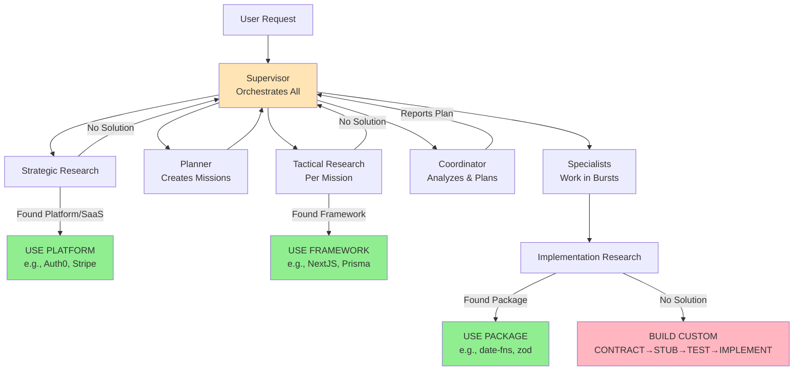
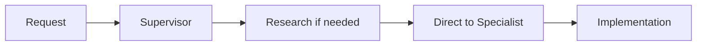

# Deterministic Unified Management of Behavioral AI agents (DUMBAI)

## Overview

Related:
- Git Flow (full): `docs/dumbai/GIT_FLOW.md`
- Git Flow Guardrails (brief): `.dumbai/common/GIT_FLOW_GUARDRAILS.md`

**D**eterministic **U**nified **M**anagement of **B**ehavioral **AI** agents is a development paradigm optimized 
for AI-assisted engineering that prioritizes compile-time validation and deterministic state management over 
traditional runtime test-driven development.

DUMBAI follows a multi-level research approach before building:

### WHO Does WHAT Research (Context Separation)

- **Strategic Research** (Planner Agent):
  - **Does**: High-level evaluation
  - **Doesn't**: Read package documentation or implementation details
  - **Context**: Keeps clean for architectural decisions
  - **Example**: "Should we use Auth0 vs build auth?"

- **Tactical Research** (Supervisor Agent):
  - **Does**: Framework/pattern selection using full project context
  - **Doesn't**: Search npm or read package docs (would pollute context)
  - **Context**: Maintains broad oversight without implementation details
  - **Example**: "Given our architecture, use NextJS App Router vs Pages?"

- **Implementation Research** (research_specialist):
  - **Does**: Deep-dive into npm packages, reads docs, compares APIs
  - **Doesn't**: Make architectural decisions
  - **Context**: Can fill with package details without affecting supervisor
  - **Example**: "Compare date-fns vs dayjs vs luxon for our needs"

**Key Insight**: The supervisor delegates detailed research to preserve its massive context window for orchestration, not package documentation.

Each research level can SHORT-CIRCUIT the entire flow below it, preventing unnecessary building. Only when no suitable solution exists at any level does DUMBAI proceed to CONTRACT→STUB→TEST→IMPLEMENT.

## Multi-Level Research Flow



**Key Principle**: Maximize reuse of existing solutions. Building from scratch is the last resort.

## Request→Missions Architecture

DUMBAI organizes work through a Request→Missions model where user requests spawn one or more missions based on complexity:

### Directory Structure
```
.dumbai/requests/
├── 2024-01-15-update-dependencies/
│   ├── request.md          # Original ask + scope evolution
│   ├── scope-log.md        # Brief scope change tracking
│   └── missions/
│       ├── audit-dependencies.md
│       ├── update-minor-versions.md
│       ├── migrate-nextjs-api.md    # Scope expanded!
│       └── fix-breaking-tests.md    # Discovered need!
└── 2024-01-16-add-vitest/
    ├── request.md
    └── missions/
        └── implement-vitest-command.md  # Simple: 1→1
```

### Mission Dependencies
Missions declare dependencies via frontmatter:
```yaml
---
mission: fix-auth-tests
status: blocked
blocked_by: [migrate-nextjs-api]  # Single source of truth
---
```

The `blocks` relationship is derived by the Supervisor to prevent inconsistencies.

### Slug-Based Naming
All identifiers use deterministic kebab-case slugs:
```typescript
function generateSlug(title: string): string {
  return title
    .toLowerCase()
    .replace(/[^a-z0-9]+/g, '-')
    .replace(/^-+|-+$/g, '')
    .replace(/--+/g, '-');
}
// "Fix Authentication Tests" → "fix-authentication-tests"
```

### Mission Lifecycle States
- `planned` - Created but not started
- `in_progress` - Actively being worked on
- `blocked` - Waiting on dependency
- `escalated` - Awaiting user decision
- `completed` - All success criteria met
- `abandoned` - Cancelled or superseded

### Deterministic Algorithms

**Central Configuration**: All thresholds and deterministic values are defined in [`.dumbai/config.json`](../../.dumbai/config.json) to ensure consistency across agents.

### Approach Selection Algorithm
When multiple valid approaches exist, use deterministic scoring:

```typescript
function selectApproach(approaches: Approach[]): Approach {
  const scores = approaches.map(a => ({
    approach: a,
    score: (a.implementationHours * 2) +
           (a.riskLevel * 3) +
           (a.maintenanceBurden * 1)
  }));
  scores.sort((a, b) => a.score - b.score);
  return scores[0].approach; // Lowest score wins deterministically
}
```

### Ambiguity Detection Algorithm
Determine if scope is ambiguous using concrete criteria:

```typescript
function isAmbiguous(context: Context): boolean {
  return (
    context.possibleFileLocations.length > 2 ||
    context.matchingPatterns.length === 0 ||
    context.conflictingPatterns.length > 0
  );
}
```

### Complexity Calculation Algorithm
Calculate complexity using measurable metrics:

```typescript
function calculateComplexity(change: Change): number {
  // NOTE: This is an estimation heuristic for planning purposes
  // Actual complexity may vary based on code structure and dependencies
  return (
    change.filesCount +
    Math.ceil(change.locChanged / 50) +  // Estimated LoC impact
    (change.packagesAffected * 3) +       // Cross-package complexity multiplier
    (change.externalAPIs * 5)             // External dependency risk factor
  );
}
```

## Deterministic Escalation
Escalation triggers are based on quality gates, not time estimates:
- Build failures
- Test failures
- Type errors
- API contract changes
- Multiple valid approaches
- Security implications

## Core Principles

1. **Research-First Development**: Always investigate existing solutions before building custom implementations
2. **Contracts as Evolving Truth**: Zod schemas define structure, validation, and types with supervised evolution
3. **Compile-Time Validation**: TypeScript catches contract violations before runtime
4. **Deterministic State**: Skipped tests with JSDoc metadata instead of failing tests
5. **Phase-Based Development**: Clear progression through defined phases with functional coherence protection
6. **Discovery-Driven Evolution**: Contracts adapt based on implementation discoveries through supervisor checkpoints
7. **Hierarchical Agent Coordination**: Multi-level AI agent roles with clear authority boundaries and context scoping
8. **Request→Missions Decomposition**: Complex requests spawn multiple missions with validated dependencies
9. **Deterministic Escalation**: Quality gates and scope boundaries trigger user intervention, not time estimates

## AI Agent Role Architecture

DUMBAI operates through a Supervisor-orchestrated model (NO NESTED SPAWNING due to technical constraints):

**Critical Architecture Note**: The Supervisor orchestrates ALL agent interactions sequentially. Agents cannot spawn other agents (technical limitation). The flow is:
1. Supervisor spawns Coordinator for analysis
2. Coordinator returns recommendations
3. Supervisor spawns Specialists based on plan
4. Supervisor manages all coordination

### Role Hierarchy

```
User (Strategic Oversight)
├── Planner Agent (Requirements Engineering)
    ├── Supervisor Agent (Mission Validation & Evolution)
        ├── Coordinator Agent (Mission-Level Orchestration)
            ├── Research Specialist (Package Discovery) [ACTIVATED FIRST]
            ├── Implementation Specialist (Code Writing)
            ├── Test Writer Specialist (Test Creation)
            ├── Test Executor Specialist (Test Running)
            ├── Reviewer Specialist (Quality Gates)
            ├── Documentation Specialist (Fact-Checking & Updates)
            └── Integration Specialist (Cross-Package) [Optional]
```

### Role Definitions

#### User (Strategic Oversight)
**Authority**: Ultimate architectural decisions, scope boundaries, strategic direction
**Context**: Full project context, business requirements, long-term technical vision
**Responsibilities**:
- Define high-level feature requirements and success criteria
- Review and approve major architectural decisions from Supervisor
- Resolve conflicts that escalate beyond Supervisor authority
- Set project priorities and resource allocation constraints

**Escalation Triggers**:
- Quality gate failures (build broken, tests failing)
- Scope boundary crossed (API changes, new dependencies)
- Multiple valid approaches requiring decision
- Security or data loss implications

#### Planner Agent (Requirements Engineering)
**Agent Definition**: [`.dumbai/agents/planner.md`](../../.dumbai/agents/planner.md)
**Authority**: Request analysis, mission creation, scope evolution tracking
**Context**: User requirements and project structure
**Responsibilities**:
- Transform user requests into structured requests with missions
- Determine complexity and spawn appropriate number of missions
- Track scope evolution in scope-log.md
- Define measurable success criteria
- Generate slug-based identifiers for all entities

#### Supervisor Agent (Mission Validation & Contract Evolution)
**Agent Definition**: [`.dumbai/agents/supervisor.md`](../../.dumbai/agents/supervisor.md)
**Authority**: Mission dependency validation, contract evolution, orchestration
**Context**: 1M+ token context window with full codebase access
**Responsibilities**:
- Validate mission dependencies and detect cycles
- Generate topological execution order
- Evaluate contract evolution requests from discovery feedback
- Handle deterministic escalations based on quality gates
- Manage mission lifecycle state transitions

**Key Functions**:
```typescript
/**
 * Supervisor responsibilities in Request→Missions workflow
 */
interface SupervisorRole {
  // Mission Management
  validateMissionDependencies(missions: Mission[]): ValidationResult;
  detectCycles(dependencyGraph: DependencyGraph): Cycle[];
  generateExecutionOrder(missions: Mission[]): Mission[];

  // Contract Evolution
  reviewDiscovery(findings: DiscoveryFeedback): ContractEvolution;
  updateContracts(evolution: ContractEvolution): UpdatedSchemas;
  notifyAffectedMissions(changes: UpdatedSchemas): void;

  // Escalation Management
  shouldEscalate(mission: Mission): boolean;
  formatEscalation(trigger: EscalationTrigger): EscalationReport;
  handleUserDecision(decision: UserDecision): MissionUpdate;
}
```

**Context Scoping**: Maintains comprehensive project context to make informed scoping and evolution decisions without context window limitations affecting worker efficiency.

#### Coordinator Agent (Mission-Level Orchestration)
**Agent Definition**: [`.dumbai/agents/coordinator.md`](../../.dumbai/agents/coordinator.md)
**Authority**: Mission execution, specialist coordination, dependency-aware scheduling
**Context**: Scoped to specific missions with their dependencies
**Responsibilities**:
- Analyze missions and create specialist task plans
- Respect mission dependencies from frontmatter `blocked_by` fields
- Report mission status to Supervisor (who updates frontmatter)
- Resolve implementation conflicts between specialists
- Optimize work distribution within mission boundaries

**Key Functions**:
```typescript
/**
 * Coordinator responsibilities within feature scope
 */
interface CoordinatorRole {
  // Work Orchestration
  scheduleParallelTasks(tasks: TaskDefinition[]): ExecutionPlan;
  manageDependencies(plan: ExecutionPlan): DependencyGraph;
  allocateResources(workers: SpecialistWorker[]): ResourceAllocation;

  // Conflict Resolution
  detectConflicts(parallelWork: WorkerProgress[]): Conflict[];
  mediateConflicts(conflicts: Conflict[]): Resolution[];
  escalateToSupervisor(unresolvableConflicts: Conflict[]): void;

  // Scope Management
  handleScopeExpansion(requests: ScopeExpansionRequest[]): ScopeDecision[];
  optimizeUtilityConsolidation(duplicates: DuplicateUtility[]): ConsolidationPlan;
}
```

**Escalation Triggers**:
- Cross-package contract changes needed
- Resource conflicts beyond allocated scope
- Architecture decisions affecting other coordinators
- Deadlocks between specialist workers

### Specialist Agent Roles

#### Research Specialist (Package Discovery)
**Agent Definition**: [`.dumbai/agents/specialists/research_specialist.md`](../../.dumbai/agents/specialists/research_specialist.md)
**Authority**: Package evaluation and build vs. buy recommendations
**Context**: npm registry, GitHub, package documentation, license databases
**Activation**: FIRST specialist activated before any implementation planning
**Responsibilities**:
- Search npm/GitHub for existing solutions
- Evaluate package health, maintenance, and popularity
- Check license compatibility and security vulnerabilities
- Assess API fit with requirements
- Present top options with pros/cons analysis
- Recommend: USE (as-is), WRAP (with adapter), or BUILD (from scratch)

**Key Functions**:
```typescript
interface ResearchSpecialistRole {
  // Package Discovery
  searchPackages(requirements: Requirements): PackageList;
  evaluateHealth(pkg: Package): HealthMetrics;
  checkLicense(pkg: Package): LicenseCompatibility;
  analyzeSecurity(pkg: Package): VulnerabilityReport;

  // Decision Support
  compareOptions(packages: Package[]): ComparisonMatrix;
  assessIntegrationEffort(pkg: Package): EffortEstimate;
  recommendDecision(analysis: Analysis): Decision; // USE | WRAP | BUILD

  // Reporting
  generateResearchReport(findings: ResearchFindings): Report;
  documentFallbackPlan(primary: Package): FallbackStrategy;
  suggestMigrationPath(from: Package, to: Package): MigrationGuide;
}
```

**Decision Criteria**:
- **USE**: Exact fit, well-maintained, good documentation
- **WRAP**: 80% fit, needs abstraction layer
- **BUILD**: No suitable packages or unique requirements

#### Implementation Specialist (Code Writing)
**Agent Definition**: [`.dumbai/agents/specialists/implementation_specialist.md`](../../.dumbai/agents/specialists/implementation_specialist.md)
**Authority**: Implementation decisions within assigned file/package scope
**Context**: Narrowly scoped to specific files/packages with read access to related contracts
**Responsibilities**:
- Implement assigned functionality following DUMBAI phases
- Document discoveries that require contract evolution
- Follow read-anywhere, write-scoped permission model
- Self-resolve type/interface issues using contract references
- Escalate scope boundary violations and architectural questions

**Key Functions**:
```typescript
interface ImplementationSpecialistRole {
  // Implementation
  implementPhase(phase: DUMBAIPhase, scope: FileScope): Implementation;
  validateContracts(implementation: Implementation): ValidationResult;
  documentDiscoveries(findings: ImplementationFindings): DiscoveryFeedback;

  // Self-Service Resolution
  resolveTypeErrors(errors: TypescriptError[]): Resolution[];
  followContractReferences(contracts: ContractReference[]): Understanding;
  implementWithinScope(requirements: TaskRequirements): ScopedImplementation;

  // Escalation
  detectScopeViolations(attempted: FileWrite[]): ScopeViolation[];
  escalateArchitecturalQuestions(uncertainties: ArchitecturalDecision[]): void;
  requestScopeExpansion(utilities: SharedUtilityNeed[]): ExpansionRequest;
}
```

#### Test Writer Specialist (Test Creation)
**Agent Definition**: [`.dumbai/agents/specialists/test_writer_specialist.md`](../../.dumbai/agents/specialists/test_writer_specialist.md)
**Authority**: Test case design and `.test.ts` file creation within assigned scope
**Context**: Implementation files, contract definitions, and existing test patterns
**Responsibilities**:
- Create comprehensive test suites during TEST phase
- Write skipped tests with proper JSDoc documentation
- Design test scenarios covering contract validation and edge cases
- Follow established testing patterns and conventions
- Document test dependencies and blocking requirements

**Key Functions**:
```typescript
interface TestWriterSpecialistRole {
  // Test Creation
  createTestSuite(implementation: Implementation, contracts: Contract[]): TestSuite;
  writeSkippedTests(requirements: TestRequirements): SkippedTestFile;
  documentTestScenarios(scenarios: TestScenario[]): TestDocumentation;

  // Test Design
  identifyEdgeCases(contracts: Contract[]): EdgeCaseTest[];
  designContractValidation(schema: ZodSchema): ValidationTest[];
  createMockStrategies(dependencies: Dependency[]): MockStrategy[];

  // Documentation
  addTestJSDoc(tests: Test[]): DocumentedTests;
  linkTestsToContracts(tests: Test[], contracts: Contract[]): LinkedTests;
  documentBlockingDependencies(tests: Test[]): BlockedByDocumentation;
}
```

#### Test Executor Specialist (Test Running)
**Agent Definition**: [`.dumbai/agents/specialists/test_executor_specialist.md`](../../.dumbai/agents/specialists/test_executor_specialist.md)
**Authority**: Test execution, CI/CD pipeline management, failure analysis
**Context**: Test suites, CI configurations, environment setups
**Responsibilities**:
- Execute test suites and analyze results
- Manage test environments and configurations
- Troubleshoot test failures and flakiness
- Handle CI/CD pipeline execution and optimization
- Report test coverage and quality metrics

**Key Functions**:
```typescript
interface TestExecutorSpecialistRole {
  // Test Execution
  runTestSuite(suite: TestSuite, environment: TestEnvironment): TestResults;
  analyzeFailures(failures: TestFailure[]): FailureAnalysis;
  handleFlakiness(flakyTests: FlakyTest[]): StabilizationPlan;

  // Environment Management
  setupTestEnvironment(requirements: EnvironmentRequirements): TestEnvironment;
  manageTestData(scenarios: TestScenario[]): TestDataManagement;
  configureCI(pipeline: CIPipeline): CIConfiguration;

  // Reporting
  generateCoverageReport(results: TestResults): CoverageReport;
  trackQualityMetrics(execution: TestExecution[]): QualityMetrics;
  reportToCoordinator(metrics: QualityMetrics): ExecutionReport;
}
```

#### Reviewer Specialist (Quality Gates)
**Agent Definition**: [`.dumbai/agents/specialists/reviewer_specialist.md`](../../.dumbai/agents/specialists/reviewer_specialist.md)
**Authority**: Code review, contract compliance verification, merge approval
**Context**: Implementation changes, test coverage, documentation quality
**Responsibilities**:
- Review code changes for contract compliance and quality standards
- Verify JSDoc documentation completeness and accuracy
- Ensure proper DUMBAI phase progression and completeness
- Validate cross-specialist work integration
- Enforce quality gates before integration approval

**Key Functions**:
```typescript
interface ReviewerSpecialistRole {
  // Code Review
  reviewImplementation(changes: CodeChanges, contracts: Contract[]): ReviewResult;
  validateContractCompliance(implementation: Implementation): ComplianceCheck;
  checkCodeQuality(code: CodeFile[]): QualityAssessment;

  // Documentation Review
  auditJSDocCompleteness(files: CodeFile[]): JSDocAudit;
  validatePhaseProgression(changes: CodeChanges): PhaseValidation;
  reviewTestCoverage(tests: TestSuite[], implementation: Implementation): CoverageReview;

  // Integration Validation
  validateCrossSpecialistWork(specialists: SpecialistWork[]): IntegrationCheck;
  enforceQualityGates(review: ReviewResult): GateDecision;
  approveForIntegration(validation: ValidationResult): ApprovalDecision;
}
```

#### Documentation Specialist (Fact-Checking & Updates)
**Agent Definition**: [`.dumbai/agents/specialists/documentation_specialist.md`](../../.dumbai/agents/specialists/documentation_specialist.md)
**Authority**: Documentation accuracy, JSDoc maintenance, README updates
**Context**: Implementation code, test results, API contracts, existing documentation
**Responsibilities**:
- Fact-check and update all documentation (*.md, JSDoc, code comments)
- Verify documentation accuracy against actual implementation
- Update stale references, examples, and API documentation
- Maintain consistency across documentation formats
- Clean up outdated TODO comments and phase-specific JSDoc

**Key Functions**:
```typescript
interface DocumentationSpecialistRole {
  // Fact-Checking
  auditDocumentationAccuracy(docs: Documentation[], implementation: Implementation): AccuracyReport;
  validateExamples(examples: CodeExample[], actualAPI: APIDefinition): ExampleValidation;
  checkReferenceLinks(links: DocumentationLink[]): LinkValidation;

  // Documentation Updates
  updateJSDocFromImplementation(implementation: Implementation): UpdatedJSDoc;
  refreshREADMEExamples(readme: README, newFeatures: Feature[]): UpdatedREADME;
  cleanObsoleteComments(files: CodeFile[]): CleanedFiles;

  // Consistency Maintenance
  standardizeDocumentationFormat(docs: Documentation[]): StandardizedDocs;
  syncAPIDocumentation(api: APIDefinition, docs: APIDocs): SynchronizedDocs;
  maintainPhaseTransitionCleanup(transitions: PhaseTransition[]): CleanupReport;
}
```

#### Integration Specialist (Cross-Package) [Optional]
**Agent Definition**: [`.dumbai/agents/specialists/integration_specialist.md`](../../.dumbai/agents/specialists/integration_specialist.md)
**Authority**: Cross-package integration testing and validation
**Context**: Multiple package APIs, integration points, end-to-end workflows
**Responsibilities**:
- **Only activated for cross-package work**
- Design and execute integration tests across package boundaries
- Validate API contract compatibility between packages
- Test end-to-end workflows spanning multiple packages
- Coordinate with multiple Implementation Specialists across packages

**Key Functions**:
```typescript
interface IntegrationSpecialistRole {
  // Cross-Package Integration
  designIntegrationTests(packages: Package[], contracts: CrossPackageContract[]): IntegrationTestSuite;
  validateAPICompatibility(apis: PackageAPI[]): CompatibilityReport;
  testEndToEndWorkflows(workflows: E2EWorkflow[]): E2ETestResults;

  // Multi-Package Coordination
  coordinateAcrossPackages(specialists: ImplementationSpecialist[]): CoordinationPlan;
  resolvePackageDependencies(dependencies: PackageDependency[]): ResolutionPlan;
  validateCrossPackageContracts(contracts: CrossPackageContract[]): ContractValidation;

  // Integration Reporting
  reportIntegrationIssues(issues: IntegrationIssue[]): IntegrationReport;
  recommendArchitecturalChanges(analysis: IntegrationAnalysis): ArchitecturalRecommendations;
}
```

**Activation Criteria**: Only assigned when task involves dependencies or API changes affecting multiple packages.

**Context Boundaries**: All specialists limited to task-assigned scope plus contract references to prevent context bloat while enabling informed decision-making.

### Communication Protocols

#### Information Flow
- **Downward**: Requirements, scope definitions, contract updates
- **Upward**: Discovery feedback, escalations, completion reports
- **Lateral** (via Coordinator): Resource conflicts, dependency coordination

#### Escalation Pathways
```typescript
/**
 * Deterministic escalation decision tree
 */
const EscalationMatrix = {
  // Worker → Coordinator
  ResourceConflict: 'coordinator',
  ScopeExpansionRequest: 'coordinator',
  ImplementationBlocking: 'coordinator',

  // Coordinator → Supervisor
  ContractEvolution: 'supervisor',
  CrossPackageDependency: 'supervisor',
  ArchitecturalDecision: 'supervisor',

  // Supervisor → User
  BreakingChange: 'user',
  MajorArchitecturalShift: 'user',
  ResourceConstraintConflict: 'user'
};
```

#### Context Scoping Strategy
Each role receives precisely the context needed for decision-making:

- **User**: Strategic context without implementation details
- **Supervisor**: Full codebase context for evolution decisions
- **Coordinator**: Feature cluster context with cross-dependencies
- **Specialist**: File scope context with contract references

This prevents context window bloat while ensuring informed decision-making at each level.

## Work Burst Pattern & Contract Evolution

### The Work Burst Pattern
Specialists work in focused **bursts** - coherent units of work with natural boundaries:

```typescript
interface WorkBurst {
  scope: "single-function" | "single-test-suite" | "single-component";
  checkpoint: "after-each-burst";  // Natural sync point
  discovery: "report-contract-needs";
  rework: "minimal-if-contracts-evolve";  // Only current burst affected
}
```

**CRITICAL**: Contract evolution happens EXCLUSIVELY between bursts, never during active work:
- Specialists complete their current burst before any contract changes
- Supervisor processes discoveries and updates contracts between bursts
- All specialists start new bursts with consistent contract versions
- This prevents mid-work invalidation and ensures atomic contract updates

### Contract Evolution Protocol
When specialists discover contract needs during implementation:

1. **Specialist completes burst** - Finishes current work unit and exits
2. **Discovery recorded** - Specialist appends to mission frontmatter before exiting:
   ```yaml
   discoveries:
     - timestamp: 2024-01-15T14:15:00Z
       specialist: impl_1
       type: contract_gap
       contract: UserSchema
       issue: "Missing required field: lastLogin"
       status: pending_review
       burst_id: burst_3
   ```
3. **Specialist exits** - Returns control to Supervisor (cannot be interrupted)
4. **Supervisor processes queue** - After specialist completes:
   - Reads discoveries from mission file
   - Evaluates if contract evolution needed
   - Updates contracts if required
   - Marks discovery as `processed`
5. **Next specialist spawn** - Gets updated contracts automatically:
   ```typescript
   // Supervisor spawns next specialist with current contract version
   spawnSpecialist({
     phase: "IMPLEMENT",
     contracts: loadCurrentContracts(), // Already updated
     previousDiscoveries: processedDiscoveries
   });
   ```

**CRITICAL**: There is NO pause/resume mechanism during execution:
- Specialists run to completion (cannot be interrupted)
- Contract updates happen between specialist executions
- Next specialist automatically gets latest contracts
- No ACK/PAUSE events needed (agents aren't running to receive them)

**Queuing Mechanism:**
- Multiple discoveries queue in order received
- Supervisor processes one contract evolution at a time
- Prevents conflicting contract changes

This approach:
- Limits blast radius (only current burst affected)
- Maintains momentum (no stop-the-world)
- Enables rapid iteration
- Prevents catastrophic rework

## State Persistence & Crash Recovery Protocol

**CRITICAL**: This protocol ensures resilience against context loss, crashes, and interrupted workflows.

### Mission File as Single Source of Truth

Mission files maintain ALL runtime state in frontmatter, enabling full recovery:

```yaml
---
mission: migrate-nextjs-api
status: in_progress
blocked_by: []
created: 2024-01-15T09:00:00Z
last_updated: 2024-01-15T14:30:00Z

# Phase & Progress Tracking
current_phase: STUB
phases_completed: [CONTRACT]
work_bursts_completed: 3
last_checkpoint: 2024-01-15T14:25:00Z

# Specialist Assignments & State
specialist_assignments:
  impl_1:
    type: implementation_specialist
    assigned_files: [src/runner.ts, src/utils.ts]
    current_file: src/runner.ts
    current_phase: STUB
    lines_modified: 47
    last_activity: 2024-01-15T14:25:00Z
    burst_in_progress: false
  test_1:
    type: test_writer_specialist
    assigned_files: [src/runner.test.ts]
    current_phase: TEST
    status: paused_for_contract
    last_activity: 2024-01-15T14:20:00Z

# Discovery Queue (Append-Only)
discoveries:
  - timestamp: 2024-01-15T14:15:00Z
    specialist: impl_1
    type: contract_gap
    contract: VitestArgsSchema
    issue: "Missing field: includeStderr"
    status: pending_review
    burst_id: burst_3
  - timestamp: 2024-01-15T14:20:00Z
    specialist: test_1
    type: validation_command
    command: "yarn validate"
    status: processed
    burst_id: burst_2

# Contract Evolution Events
contract_events:
  - timestamp: 2024-01-15T14:22:00Z
    type: CONTRACT_DISCOVERED
    specialist: impl_1
    contract: VitestArgsSchema
    issue: "Missing includeStderr field"
  - timestamp: 2024-01-15T14:23:00Z
    type: CONTRACT_UPDATED
    contract: VitestArgsSchema
    version: 1.2.0
    changes: "Added includeStderr: z.boolean().optional()"
  - timestamp: 2024-01-15T14:24:00Z
    type: SPECIALIST_RESPAWNED
    specialist: impl_1
    reason: "Contract updated, re-execute with new schema"

# Validation Results Cache
validation_cache:
  last_run: 2024-01-15T14:24:00Z
  command: "yarn validate"
  files_validated:
    src/runner.ts: passed
    src/utils.ts: passed
    src/runner.test.ts: skipped_test
  errors: []
---
```

### Recovery Protocol

When any agent starts or recovers from crash:

```typescript
function recoverState() {
  // Priority Order for State Recovery:
  // 1. Mission file frontmatter (single source of truth)
  const mission = readMissionFile();

  // 2. Git status (detect uncommitted work - secondary evidence)
  const gitStatus = await git.status();

  // 3. Reconcile using Evidence Hierarchy
  // MEASURED (mission file) > DERIVED (git status) > ASSUMPTION
  if (gitStatus.modified.length > 0) {
    // Work in progress detected
    const lastCheckpoint = mission.last_checkpoint;
    const timeSinceCheckpoint = Date.now() - lastCheckpoint;

    if (timeSinceCheckpoint > BURST_TIMEOUT) {
      // Likely crashed mid-burst
      // Mission file state takes precedence over git changes
      // Git changes are evidence of incomplete work, not authoritative state
      return recoverFromIncompleteBurst(mission, gitStatus);
    }
  }

  // 4. Resume from mission file state (authoritative)
  return {
    phase: mission.current_phase,  // From mission file
    assignments: mission.specialist_assignments,  // From mission file
    pendingDiscoveries: mission.discoveries.filter(d => d.status === 'pending_review'),
    contractState: mission.contract_events[mission.contract_events.length - 1]
  };
}
```

### Specialist State Checkpointing

Specialists update their state after each burst:

```typescript
function completeBurst(specialist: string, burstResult: BurstResult) {
  // Append discoveries (never delete/modify existing)
  mission.discoveries.push({
    timestamp: new Date().toISOString(),
    specialist,
    burst_id: `burst_${mission.work_bursts_completed + 1}`,
    ...burstResult.discoveries
  });

  // Update specialist state
  mission.specialist_assignments[specialist] = {
    ...mission.specialist_assignments[specialist],
    last_activity: new Date().toISOString(),
    burst_in_progress: false,
    lines_modified: burstResult.linesModified,
    current_phase: burstResult.phase
  };

  // Increment burst counter
  mission.work_bursts_completed++;
  mission.last_checkpoint = new Date().toISOString();
}
```

### Supervisor State Reading

Supervisor processes discoveries sequentially:

```typescript
function processDiscoveryQueue() {
  const missions = loadAllMissions();

  for (const mission of missions) {
    const pending = mission.discoveries.filter(d => d.status === 'pending_review');

    // Process in order received (FIFO)
    for (const discovery of pending) {
      const action = evaluateDiscovery(discovery);

      if (action.type === 'CONTRACT_EVOLUTION') {
        // Update contract (specialists aren't running)
        updateContract(action.contract, action.changes);

        // Mark discovery as processed
        discovery.status = 'processed';

        // Record which specialists need re-execution
        mission.specialists_need_rerun.push(...action.affected);
      }
    }
  }
}
```

### Critical Recovery Scenarios

#### 1. Specialist Crashes Mid-Burst
- Git shows uncommitted changes
- Mission file shows `burst_in_progress: true`
- Recovery: Complete or rollback partial work based on checkpoint

#### 2. Supervisor Crashes During Contract Evolution
- Contract events show CONTRACT_UPDATED without SPECIALIST_RESPAWNED
- Some specialists executed with old contract
- Recovery: Identify which specialists need re-execution with new contract

#### 3. Complete Context Loss
- No agent memory of previous work
- Recovery: Mission file provides full state reconstruction
- Git status shows actual file state
- Reconcile and continue from last checkpoint

#### 4. Concurrent Specialist Conflict
- Multiple specialists modified same file (shouldn't happen)
- Recovery: Use Resource Ownership Matrix to determine authority
- Rollback unauthorized changes

### State Persistence Rules

1. **Append-Only Discoveries**: Never delete or modify existing discoveries
2. **Atomic Frontmatter Updates**: Use file locking or atomic writes
3. **Checkpoint Frequently**: After each burst, not just phase completion
4. **Git as Backup**: Unstaged changes = work in progress, staged = checkpoint
5. **Timestamp Everything**: Enables forensic reconstruction if needed

## Development Phases

### Phase 0: RESEARCH
Investigate existing solutions before building custom implementations.

```typescript
// Research existing packages that solve this problem
const research = {
  searched: ['npm', 'github', 'bundlephobia'],
  evaluated: ['commander', 'yargs', 'minimist'],
  decision: 'USE', // USE | WRAP | BUILD
  rationale: 'Commander provides exact functionality needed with excellent TypeScript support'
};
```

**Key Activities:**
- Search npm/GitHub for existing solutions
- Evaluate package health, maintenance, and popularity
- Check license compatibility and security vulnerabilities
- Assess API fit with requirements
- Present options with pros/cons
- Recommend: USE (as-is), WRAP (with adapter), or BUILD (from scratch)

**Decision Matrix:**
- **USE**: Package fits requirements exactly, well-maintained
- **WRAP**: Package needs abstraction layer or slight adaptation
- **BUILD**: No suitable packages exist or unique requirements

### Phase 1: CONTRACT
Define the Zod schema that serves as the executable contract.

**Note**: If RESEARCH phase selected USE/WRAP, contracts adapt to package interfaces rather than creating new ones.

```typescript
// packages/models/src/contracts/worktree.contract.ts
import { z } from 'zod';

export const WorktreeOptionsSchema = z.object({
  force: z.boolean().optional().describe('Force overwrite existing worktree'),
  switch: z.boolean().optional().describe('Switch to existing if found'),
  dryRun: z.boolean().optional().describe('Preview without creating')
});

export const CreateWorktreeInputSchema = z.object({
  name: z.string()
    .min(1)
    .max(50)
    .regex(/^[a-z0-9-]+$/, 'Only lowercase letters, numbers, and hyphens'),
  options: WorktreeOptionsSchema.optional()
});

// Export inferred types for zero-runtime usage
export type WorktreeOptions = z.infer<typeof WorktreeOptionsSchema>;
export type CreateWorktreeInput = z.infer<typeof CreateWorktreeInputSchema>;
```

### Phase 2: STUB
Create implementation with correct signatures that validates contracts.

```typescript
// packages/cli/src/services/worktree.ts
import { CreateWorktreeInputSchema, type WorktreeOptions } from '@haino/models';

/**
 * Creates a new git worktree for feature development
 * @phase STUB
 * @todo [#273][STUB] Implement createWorktree
 * @created 2025-09-12 in abc123
 * @contract WorktreeOptionsSchema
 * @see {@link file:../../models/src/contracts/worktree.contract.ts:5}
 * @see {@link https://github.com/edgora-hq/haino-internal/issues/273}
 */
export async function createWorktree(
  name: string,
  options?: WorktreeOptions
): Promise<void> {
  // Validate inputs against contract (compile-time + runtime validation)
  CreateWorktreeInputSchema.parse({ name, options });
  
  // Stub returns valid shape
  return Promise.resolve();
}
```

### Phase 3: TEST
Write behavioral tests that are skipped but contract-validated.

```typescript
// packages/cli/src/services/__tests__/worktree.test.ts
import { createWorktree } from '../worktree';
import { CreateWorktreeInputSchema } from '@haino/models';

/**
 * Contract validation for worktree name restrictions
 * @phase TEST
 * @todo [#274][TEST] Unskip when createWorktree implemented
 * @blocked-by [#273][STUB] createWorktree implementation
 * @contract WorktreeOptionsSchema
 * @see {@link file:../../../models/src/contracts/worktree.contract.ts:5}
 */
test.skip('validates worktree name format', async () => {
  // Contract validation happens even in skipped tests at compile time
  const validInput = { name: 'feature-x' };
  expect(() => CreateWorktreeInputSchema.parse(validInput)).not.toThrow();
  
  // Behavioral test for when implementation lands
  await expect(createWorktree('!!invalid!!')).rejects.toThrow('Invalid name');
});

/**
 * Contract validation for successful worktree creation
 * @todo [#274][TEST] Unskip when createWorktree implemented
 * @blocked-by [#273][STUB] createWorktree implementation
 * @contract WorktreeOptionsSchema
 */
test.skip('creates worktree with valid name', async () => {
  await createWorktree('feature-branch');
  // Assertion would go here once we have return values
});
```

### Phase 4: IMPLEMENT
Replace stub with actual implementation, keeping contracts.

```typescript
/**
 * Creates a new git worktree for feature development
 * @since 2025-09-12
 * @contract WorktreeOptionsSchema
 * @see {@link file:../../models/src/contracts/worktree.contract.ts:5}
 */
export async function createWorktree(
  name: string,
  options?: WorktreeOptions
): Promise<void> {
  // Contract validation remains
  CreateWorktreeInputSchema.parse({ name, options });
  
  // Real implementation
  const { execa } = await import('execa');
  await execa('git', ['worktree', 'add', name]);
  
  if (options?.switch) {
    await execa('git', ['checkout', name]);
  }
}
```

### Phase 5: VALIDATE
Unskip tests and verify they pass.

```typescript
// Simply remove .skip from tests
test('validates worktree name format', async () => {
  await expect(createWorktree('!!invalid!!')).rejects.toThrow('Invalid name');
});
```

## JSDoc Requirements

Every artifact in the DUMBAI workflow MUST have comprehensive JSDoc with specific tags:

### Required Tags by Phase

#### STUB Phase
```typescript
/**
 * Brief description of the function
 * @todo [#{issue}][STUB] Implement {function}
 * @created {date} in {commit}
 * @contract {SchemaName}
 * @see {@link file:../../models/src/contracts/{contract}.ts:{line}}
 * @see {@link https://github.com/edgora-hq/haino-internal/issues/{issue}}
 */
```

#### TEST Phase
```typescript
/**
 * Test description explaining what behavior is being validated
 * @todo [#{issue}][TEST] Unskip when {dependency} implemented
 * @blocked-by [#{issue}][{PHASE}] {blocking-item}
 * @contract {SchemaName}
 * @see {@link file:../../../models/src/contracts/{contract}.ts:{line}}
 */
```

#### Implementation Phase
```typescript
/**
 * Complete description of the function
 * @since {date}
 * @contract {SchemaName}
 * @param {name} - Description with contract reference
 * @returns Description with contract reference
 * @throws {ErrorType} When validation fails
 * @see {@link file:../../models/src/contracts/{contract}.ts:{line}}
 * @example
 * ```typescript
 * await createWorktree('feature-x', { switch: true });
 * ```
*/
```

### TODO Taxonomy

TODOs follow a strict format for machine readability:

```
@todo [#{issue}][{PHASE}] {description}
```

Where PHASE is one of:
- `RESEARCH` - Package evaluation needed
- `CONTRACT` - Schema definition needed
- `STUB` - Implementation needed
- `TEST` - Test needs unskipping
- `IMPLEMENT` - Implementation in progress
- `REFACTOR` - Cleanup needed
- `DISCOVERY` - Contract evolution needed based on implementation findings

### Discovery Feedback

Workers report implementation discoveries that require contract evolution:

```typescript
/**
 * @discovery Worker found need for stderr filtering controls during vitest execution
 * @impact Requires VitestArgsSchema update to include stderr handling options
 * @supervisor-review Contract evolution needed before proceeding
 */
```

### Cross-References

Use `@see` tags to create navigable links:
- `@see {@link file:../path/to/file.ts:{line}}` - Link to local file
- `@see {@link https://github.com/...}` - Link to issue/PR
- `@see {@link symbol:ClassName#methodName}` - Link to symbol

Use `@blocked-by` to create dependency chains:
- `@blocked-by [#{issue}][{PHASE}]` - Creates queryable dependency graph
- `@supervisor-review` - Indicates need for contract evolution approval
- `@discovery` - Documents implementation findings that affect contracts

## Package Structure

### Contract Organization

```
@haino/models/src/
contracts/           # Cross-package contracts (public APIs)
session.contract.ts
bus.contract.ts
cli/                 # Package-specific contracts (semi-public)
ui-state.contract.ts
mcp/
cache.contract.ts

packages/cli/src/
contracts/           # Package-internal contracts (private)
init-flow.contract.ts
```

### Bundle Optimization

```javascript
// esbuild.config.js
{
  external: ['zod'],  // Exclude from production bundle
  alias: {
    'zod': './stubs/zod-noop.js'  // Stub for production
  }
}
```

This ensures:
- Development gets full Zod validation
- Production gets zero-runtime overhead
- Types are always available via `z.infer<>`

## Validation Gates

### Preflight Gates

Each phase has validation gates that must pass:

1. **preflight:contract-pass**
    - All schemas compile
    - Types can be inferred
    - No circular dependencies

2. **preflight:stubs-pass**
    - All stubs match contract signatures
    - Contract validation calls present
    - JSDoc TODO tags present

3. **preflight:tests-pass**
    - All tests compile (even skipped)
    - Contract imports resolve
    - JSDoc blocked-by tags present

4. **preflight:impl-pass**
    - All tests pass (unskipped)
    - Contract validation remains
    - TODOs removed or updated

### CI Integration

```yaml
# .github/workflows/preflight.yml
contract-validation:
  - Check all .contract.ts files compile
  - Validate schema exports match type exports
  - Ensure JSDoc @contract tags resolve

todo-tracking:
  - Extract all @todo tags
  - Verify TODO format compliance
  - Check blocked-by chains are valid
  - Ensure no orphaned TODOs

phase-progression:
  - Verify files move through phases in order
  - Check that skipped tests have valid TODOs
  - Ensure implemented code has no STUB TODOs
```

## Contract Evolution Protocol

### Discovery Feedback Loop

When workers encounter contract friction during implementation:

1. **Worker Documents Discovery**
   ```typescript
   /**
    * @discovery Found that vitest requires stderr filtering for token optimization
    * @impact Current VitestArgsSchema missing includeStderr field
    * @supervisor-review Contract update needed
    */
   ```

2. **Supervisor Evaluates Discovery**
   - Reviews implementation findings
   - Assesses impact on other workers
   - Decides on contract evolution approach
   - Updates contracts with versioning

3. **Contract Evolution**
   ```typescript
   // Before discovery
   export const VitestArgsSchema = z.object({
     pattern: z.string().optional()
   });

   // After supervisor evolution
   export const VitestArgsSchema = z.object({
     pattern: z.string().optional(),
     includeStderr: z.boolean().default(false) // Added based on discovery
   });
   ```

4. **Notification and Continuation**
   - All dependent workers notified of contract changes
   - Implementation continues with evolved contract
   - Discovery tags removed, implementation proceeds

### Supervisor Checkpoints

After each development phase:
1. **Discovery Review** - Examine all @discovery tags
2. **Contract Impact Assessment** - Evaluate need for schema evolution
3. **Breaking Change Analysis** - Ensure backward compatibility where possible
4. **Evolution Decision** - Update contracts or request implementation refinement
5. **Worker Notification** - Communicate contract changes to all affected workers

### Task Complexity Pre-Assessment

Supervisor assigns JSDoc documentation level based on deterministic complexity factors:

#### Complexity Indicators
- **Files involved**: 1-2 files = Level 1, 3-5 files = Level 2, 6+ files = Level 3
- **Estimated LoC changes**: <50 lines = Level 1, 50-200 lines = Level 2, 200+ lines = Level 3
- **Cross-package dependencies**: None = Level 1, Single package = Level 2, Multiple packages = Level 3
- **Integration points**: Internal only = Level 1, Package API = Level 2, External API = Level 3

#### Complexity Discovery Protocol
When worker discovers task is more complex than supervisor estimated:
```typescript
/**
 * @complexity-escalation Task requires more files/changes than estimated
 * @original-estimate Level 1 (2 files, 30 LoC)
 * @actual-discovery Level 2 (5 files, 150 LoC, cross-package dependency)
 * @supervisor-review Complexity re-assessment needed
 */
```

#### JSDoc Documentation Levels

Based on complexity assessment, supervisor assigns appropriate JSDoc detail level:

**Level 1: Minimal Documentation (Simple Tasks)**
```typescript
/**
 * Brief description of the function
 * @contract SchemaName
 * @todo [#123][STUB] Implement function
 */
```
- Basic contract reference only
- Escalate for any uncertainty
- Suitable for: 1-2 files, <50 LoC, internal utilities

**Level 2: Guided Documentation (Standard Tasks)**
```typescript
/**
 * Brief description of the function
 * @contract SchemaName
 * @see {@link file:../../contracts/schema.contract.ts:15}
 * @todo [#123][STUB] Implement function
 * @blocked-by [#122][STUB] Dependency implementation
 */
```
- Contract reference with file links
- Dependency chain documentation
- Self-service for type/interface resolution
- Suitable for: 3-5 files, 50-200 LoC, single package

**Level 3: Extended Documentation (Complex Tasks)**
```typescript
/**
 * Complete description of the function with context
 * @contract SchemaName
 * @see {@link file:../../contracts/schema.contract.ts:15}
 * @example Usage: {@link file:../examples/usage.ts}
 * @architecture {@link file:../docs/architecture.md}
 * @todo [#123][STUB] Implement function
 * @blocked-by [#122][STUB] Dependency implementation
 */
```
- Full context with examples and architecture links
- Self-service for most implementation decisions
- Escalate only for breaking changes
- Suitable for: 6+ files, 200+ LoC, cross-package dependencies

### Functional Coherence Protection

DUMBAI phases may be overridden when functional coherence is at risk:

#### When to Override Phases
- **Algorithmic Unity**: Complex algorithms that lose meaning when split
- **Error Context**: Error handling that requires full execution context
- **Performance Optimization**: Code where splitting would create performance overhead
- **Domain Logic**: Business logic with inherent conceptual unity

#### Override Documentation
```typescript
/**
 * @functional-coherence Vitest execution and parsing must stay unified
 * @phase-override Implementing executeVitest as single unit despite size
 * @justification Splitting would lose error context and execution flow
 * @contract VitestExecutionSchema
 */
export async function executeVitest(args: VitestArgs): Promise<VitestResult> {
  // 200+ lines of unified functionality
}
```

### AI Agent Behavior Guidelines

Guide AI agents toward productive proactive behavior while avoiding common anti-patterns:

#### Encouraged Proactive Behaviors
- **Reading contract files** to understand types and interfaces
- **Following established patterns** from referenced examples
- **Staying within defined architectural boundaries**
- **Making informed decisions** based on documented context
- **Using JSDoc references** to resolve implementation questions

#### Discouraged Anti-Patterns
- **File system exploration** (`ls -la`, random directory traversal)
- **Guessing at interfaces** based on partial context
- **Making assumptions** about method signatures without documentation
- **Creating interfaces** that don't match existing patterns
- **Architectural improvisation** without supervisor guidance

### Escalation Decision Matrix

Specific guidance on when to self-resolve vs escalate by decision type:

| Decision Type | Self-Service | Escalate | Example |
|--------------|-------------|----------|----------|
| **Type Issues** | ✅ Read contract files | ❌ | `VitestExecuteArgs` type error → Read `vitest.contract.ts` |
| **Interface Changes** | ❌ | ✅ Always escalate | Need to add field to existing schema → Escalate |
| **Algorithm Choices** | ✅ With examples/docs | ❌ | Output parsing approach → Use provided examples |
| **Architecture Decisions** | ❌ | ✅ Always escalate | Whether to use streams vs buffers → Escalate |
| **Scope Boundary Questions** | ❌ | ✅ Always escalate | Unsure if file is in scope → Escalate |

### AI Agent Decision Tree

Workers follow this deterministic decision tree for self-containment vs escalation:

```typescript
/**
 * Decision tree for AI agents:
 * 1. Can I complete my task by READING existing files? → Self-service
 * 2. Does reading reveal I need to CHANGE files outside my scope? → Document discovery, escalate
 * 3. Am I making ASSUMPTIONS about behavior not documented? → Escalate
 * 4. Can I solve by changing ONLY files in my task scope? → Self-service with documentation
 */
```

### Core Design Resolution: Type Error Handling

**Scenario**: Agent encounters type error with `VitestExecuteArgs`

**Option A (Rejected)**: Escalate immediately
```typescript
/**
 * @todo [#124][TEST] Type error with VitestExecuteArgs - escalate to supervisor
 * @issue Cannot determine correct interface for executeViaMCP arguments
 */
test.skip('should handle vitest execution', () => {
  // Type error here - stopping work
});
```

**Option B (Adopted)**: Self-resolve via contract references
```typescript
/**
 * @contract VitestExecuteArgsSchema
 * @see {@link file:../../contracts/vitest.contract.ts:15}
 */
test.skip('should handle vitest execution', () => {
  const args: VitestExecuteArgs = { // Agent reads contract to fix this
    pattern: "**/*.test.ts",
    verbosity: "normal"
  };
});
```

**Resolution Rationale**: AI agents will be proactive regardless. Better to provide good references for productive proactivity than force escalation for resolvable issues.

### Task Scope Determination

Workers determine scope boundaries using this hierarchy:

## Worker Permission Model

### Read-Anywhere, Write-Scoped Architecture

Workers operate under a permissive read model with strict write boundaries:

- **Read Permissions**: Unlimited access to any file in codebase for understanding context
- **Write Permissions**: Restricted to files within assigned task scope
- **Cross-package Writes**: Automatically trigger escalation to coordinator
- **Scope Violations**: Detected by attempted writes outside boundary, not by reads

This model enables informed decision-making while preventing architectural chaos.

#### Scope Boundary Rules
1. **File-based scoping** (primary): Files explicitly listed in task assignment
2. **Package-based scoping** (secondary): Files within same package when functionally related
3. **Feature-based scoping** (tertiary): Files that implement same logical feature

#### Under-Scoping Resolution Protocol

When workers discover shared utilities that should exist in broader scope:

**Self-Service Implementation** (Preferred):
```typescript
/**
 * @scope-expansion-request Implemented shared vitest execution logic locally
 * @local-implementation packages/commands/vitest/src/vitest-executor.ts
 * @proposed-consolidation packages/commands/core/src/vitest-utils.ts
 * @reuse-evidence Will be needed by test-runner, coverage-analyzer commands
 * @consolidation-priority Medium - cleanup after current sprint
 */
```

**Rationale**: Maintaining parallel work momentum outweighs theoretical duplication risks. Consolidation happens as separate cleanup task based on actual usage evidence.

#### Scope Boundary Examples

**Clear In-Scope**:
- `vitest-runner.ts` (assigned file)
- `vitest-runner.test.ts` (test for assigned file)

**Clear Out-of-Scope**:
- `../../contracts/vitest.contract.ts` (different package)
- `../other-command/runner.ts` (different feature)

**Ambiguous Cases (Escalate)**:
- `error-types.ts` (shared utility - package scope unclear)
- `global-error-handler.ts` (global vs package scope)
- `process-manager.ts` (infrastructure vs feature scope)

#### Edge Case Handling Protocols

**Scope Boundary Ambiguity**
```typescript
/**
 * @scope-ambiguity Unclear if error-types.ts is in scope for vitest-runner task
 * @boundary-question Is shared utility within package scope or requires escalation?
 * @supervisor-review Need scope clarification before proceeding
 */
```

**Cascade Dependencies (Reading Chain Limit)**
- **Allowed**: Contract → Example → Direct dependency (max 3 hops)
- **Escalate**: Reading beyond 3 hops indicates scope creep
```typescript
/**
 * @cascade-limit Reached 3-hop reading limit: contract → example → utility → base-class
 * @exploration-boundary Further reading may indicate scope expansion needed
 * @supervisor-review Assess if task scope should be expanded
 */
```

**Read Reveals Need for Change**
```typescript
/**
 * @read-discovery Contract reading revealed missing includeStderr field
 * @change-required Field addition needed in vitest.contract.ts (outside scope)
 * @escalate-reason Cannot modify files outside task scope
 * @supervisor-review Contract evolution vs workaround decision needed
 */
```

#### Decision Tree Examples

**Type Error Resolution (Self-Service)**
```typescript
// Worker encounters type error, reads contract file, fixes type
const args: VitestExecuteArgs = {
  pattern: "**/*.test.ts", // ✓ Found in vitest.contract.ts
  verbosity: "normal"      // ✓ Found in vitest.contract.ts
};
```

**Missing Contract Field (Escalate)**
```typescript
/**
 * @discovery Contract missing required includeStderr field
 * @scope-analysis Reading vitest.contract.ts revealed need for change outside worker scope
 * @escalate-reason Cannot modify contract file - outside task scope
 * @supervisor-review Contract evolution needed
 */
```

**Assumption About Behavior (Escalate)**
```typescript
/**
 * @assumption-escalation Unclear if vitest JSON output format is stable across versions
 * @behavior-uncertainty No documentation on output format compatibility
 * @supervisor-review Need architectural guidance on parser implementation
 */
```

### Parallel Worker Coordination

#### Contract Authority Matrix
| Contract Scope | Authority | Change Process |
|---------------|-----------|----------------|
| Cross-package APIs | Supervisor only | Full impact assessment |
| Package-specific | Lead worker + supervisor | Impact on package workers |
| Internal utilities | Worker autonomy | Notification to supervisor |

#### Conflict Resolution
1. **Detection**: Automated scanning for overlapping contract changes
2. **Escalation**: Conflicting workers report to supervisor
3. **Resolution**: Supervisor mediates and establishes contract direction
4. **Implementation**: Workers adapt to supervisor-resolved contracts

## Resource Ownership Matrix

Clear ownership prevents write conflicts and ensures deterministic outcomes:

| Resource Type | Owner | Can Modify | Can Read | Notes |
|--------------|-------|------------|----------|--------|
| **Mission Frontmatter - Core** | Supervisor | ✅ | All agents | status, phase, assignments, validation_cache |
| **Mission Frontmatter - Discoveries** | Specialists | ➕ | All agents | Append-only to discoveries array |
| **Mission Content** | Planner | ✅ | All agents | Body content below frontmatter |
| **Contracts (Zod)** | Supervisor | ✅ | All specialists | Contract evolution only via Supervisor |
| **Implementation Code** | Implementation Specialist | ✅ | All specialists | Within assigned file scope only |
| **Test Code** | Test Writer Specialist | ✅ | All specialists | Test files only, not implementation |
| **JSDoc - @todo tags** | Implementation Specialist | ✅ | All specialists | Created during STUB phase |
| **JSDoc - @since tags** | Implementation Specialist | ✅ | All specialists | Added during IMPLEMENT phase |
| **JSDoc - @blocked-by tags** | Test Writer Specialist | ✅ | All specialists | Added during TEST phase |
| **JSDoc - Documentation** | Documentation Specialist | ➕ | All specialists | Can ADD @param/@returns/@example, cannot modify phase tags |
| **Configuration Files** | Supervisor | ✅ | All agents | package.json, tsconfig, etc. |
| **Validation Commands** | First Discoverer | 📝 | All specialists | Cached in project state |
| **Discovery Queue** | Specialists | ➕ | Supervisor | Append-only to mission frontmatter |
| **State Checkpoints** | Each Specialist | ✅ | Supervisor | Own state only in mission file |

**Legend:**
- ✅ Full write access
- ➕ Append-only access
- 📝 Write once, read many
- All agents can read everything within their scope boundaries

**Conflict Resolution:**
1. If multiple specialists need to modify the same file → Sequential execution
2. If Documentation and Implementation overlap → Implementation takes precedence
3. If discovery conflicts arise → Supervisor resolves deterministically

### File Locking Strategy

**Simplified Approach (Recommended):**
- No complex locking needed for append-only discovery entries
- YAML append operations are typically atomic for small entries
- Supervisor processes discoveries sequentially between specialist executions
- If file corruption detected: Use git to recover last known good state

**When Locking IS Needed:**
- Large file modifications (>1000 lines)
- Binary file updates
- Database schema migrations
- Cross-process coordination (multiple CLI instances)

**Implementation if Required:**
```typescript
// Simple file-based lock
const lockFile = `${missionFile}.lock`;
const acquireLock = () => fs.writeFileSync(lockFile, process.pid);
const releaseLock = () => fs.unlinkSync(lockFile);
const hasLock = () => fs.existsSync(lockFile);
```

## Scope Guidelines

### Use DUMBAI For:
- **Multi-worker coordination boundaries** (>1 AI agent involved)
- **Cross-package public APIs** (external integration points)
- **Complex state management** (shared mutable state)
- **AI agent handoff points** (between different specialized agents)

### Lighter Approaches For:
- **Internal utilities** (<100 lines, single responsibility)
- **Pure functions** (no external dependencies or side effects)
- **Exploratory prototypes** (high uncertainty, rapid iteration needed)
- **Performance-critical algorithms** (where abstraction adds overhead)

### DUMBAI Overhead Justification
The comprehensive JSDoc and phase structure is justified when:
- Multiple AI agents need coordination
- Contract evolution is expected
- Integration complexity is high
- Long-term maintenance is critical

## Benefits Over Traditional TDD

### For AI Agents
- No confusing RED state (expected vs actual failures)
- Deterministic phase detection via JSDoc tags
- Contract validation prevents signature drift
- Clear dependency chains via blocked-by
- Discovery feedback mechanism for contract evolution
- Supervisor checkpoints prevent architectural drift

### For Humans
- Compile-time feedback faster than runtime
- JSDoc provides rich context in IDE
- Skipped tests keep CI green during development
- Contract changes tracked in one place

### For Teams
- Parallel development without phase conflicts
- Clear handoff points between phases
- Queryable work state via TODO taxonomy
- No ambiguous CI failures
- Systematic contract evolution process
- Functional coherence protection when needed

## Migration Strategy

For existing TDD codebases:

1. **Identify current test state** - Which are red, which are green
2. **Extract contracts** - Create Zod schemas from existing interfaces
3. **Add JSDoc tags** - Document current phase for each component
4. **Skip failing tests** - With proper TODO and blocked-by tags
5. **Implement phase gates** - Add preflight validation to CI

## Fastlane for Single-Mission Requests

When a request maps to a single mission (common for small tasks):



**Fastlane Optimizations**:
- Skip Coordinator (Supervisor manages directly)
- Skip Planner (single mission obvious)
- Skip multi-phase if <100 LoC
- Direct Supervisor → Specialist communication

**Criteria for Fastlane**:
- Single mission scope
- <3 files affected
- No cross-package changes
- Clear implementation path
- No ambiguous requirements

## Anti-Patterns to Avoid

### ❌ Mixing Phases in Single File
```typescript
// BAD: Both stub and implementation
export function featureA() { /* stub */ }
export function featureB() { /* implemented */ }
```

### ❌ Skipping Without Documentation
```typescript
// BAD: No context for why skipped
test.skip('does something', () => {});
```

### ❌ Runtime Phase Detection
```typescript
// BAD: Complex branching based on phase
if (process.env.PHASE === 'STUB') { /* ... */ }
```

### ✅ Correct Approach
```typescript
/**
 * @todo [#123][STUB] Implement feature
 * @contract FeatureSchema
 */
export function feature() { /* stub */ }

/**
 * @todo [#124][TEST] Unskip when feature implemented
 * @blocked-by [#123][STUB]
 */
test.skip('validates feature', () => {});
```

## Tooling Support

### Recommended VSCode Extensions
- **TODO Tree**: Visualize TODO taxonomy
- **JSDoc**: Syntax highlighting and validation
- **Zod**: Schema IntelliSense

### CLI Commands
```bash
# Find all stubs ready for implementation
grep -r "@todo.*STUB" --include="*.ts"

# Find tests ready to unskip
grep -r "@blocked-by.*STUB" --include="*.test.ts" | \
  xargs grep -l "@todo.*TEST.*Unskip"

# Validate contract coverage
find . -name "*.ts" -exec grep -l "export.*function" {} \; | \
  xargs grep -L "@contract"
```

## Phase-Based JSDoc Requirements Matrix

JSDoc documentation level varies by development phase to provide appropriate context without overwhelming agents:

| JSDoc Property | CONTRACT | STUB | TEST | IMPLEMENT | Purpose |
|---------------|----------|------|------|-----------|----------|
| `@contract` | ✅ Required | ✅ Required | ✅ Required | ✅ Required | Contract validation |
| `@todo` | ❌ Forbidden | ✅ Required | ✅ Required | ❌ Forbidden | Phase tracking |
| `@phase` | ✅ Required | ✅ Required | ✅ Required | ✅ Required | Workflow state |
| `@complexity-level` | ✅ Required | ✅ Required | 🟨 Optional | ❌ Forbidden | Supervisor guidance |
| `@see` (file links) | ❌ Forbidden | 🟨 Optional* | ✅ Required | ✅ Required | Self-service context |
| `@example` | ❌ Forbidden | ❌ Forbidden | 🟨 Optional | ✅ Required | Implementation guidance |
| `@architecture` | ❌ Forbidden | ❌ Forbidden | ❌ Forbidden | 🟨 Optional* | Design context |
| `@escalate-if` | 🟨 Optional | ✅ Required | ✅ Required | 🟨 Optional | Boundary guidance |
| `@scope-boundary` | 🟨 Optional | ✅ Required | ✅ Required | 🟨 Optional | Task limits |
| `@discovery` | ❌ Forbidden | ✅ Required | ✅ Required | ❌ Forbidden | Evolution tracking |

*Level-dependent: Level 2+ complexity only

### Phase Transition Protocol

When worker discovers task complexity exceeds initial assessment:

1. **Document Discovery**
```typescript
/**
 * @complexity-escalation Task exceeds initial Level 1 assessment
 * @discovery-evidence 5 files required, cross-package dependencies found
 * @jsdoc-upgrade-request Level 1 → Level 2 documentation needed
 * @supervisor-review JSDoc matrix upgrade required before proceeding
 */
```

2. **Escalate to Supervisor** - Worker stops implementation
3. **Supervisor Assessment** - Reviews discovery evidence
4. **JSDoc Matrix Update** - Supervisor updates documentation requirements
5. **Worker Continuation** - Proceeds with upgraded documentation level

### Self-Service Documentation Guidelines

Workers follow this deterministic decision tree for JSDoc additions:

```typescript
/**
 * Worker self-service JSDoc decision tree:
 * 1. Does this JSDoc document MY implementation? → Self-service allowed
 * 2. Does this JSDoc reference files ASSIGNED to me? → Self-service allowed
 * 3. Does this JSDoc affect OTHER workers' understanding? → Escalate
 * 4. Does this JSDoc change task BOUNDARIES or SCOPE? → Escalate
 */
```

#### ✅ Self-Service Allowed
- `@param` documentation for methods I'm implementing
- `@returns` documentation for functions I'm creating
- `@throws` documentation for error cases I discovered during implementation
- `@see` links to contract files already in my task scope
- `@example` usage patterns for functionality I discovered
- `@internal` notes for implementation-specific details

#### ❌ Must Escalate
- `@architecture` decisions affecting other workers
- `@performance-requirement` constraints that impact others
- `@see` links to files outside my assigned scope
- Cross-package or cross-feature references
- Integration patterns affecting other workers
- Any JSDoc that changes task boundaries or scope understanding

**Deterministic Rule**: If JSDoc addition affects understanding **outside worker's task scope**, escalate to supervisor.

## Real-World Observability Framework

Track DUMBAI effectiveness through systematic observation of AI agent behaviors and outcomes:

### JSDoc Effectiveness Metrics

#### Context Hit Rate
- **Measure**: Percentage of agent questions resolved via JSDoc vs escalation
- **Target**: >80% self-resolution for Level 2+ documentation
- **Red Flag**: <60% indicates insufficient JSDoc context or poor reference quality

#### Scope Creep Incidents
- **Measure**: Frequency of agents working outside assigned task boundaries
- **Tracking**: `@scope-violation` incidents per sprint
- **Pattern Analysis**: Which JSDoc properties correlate with scope expansion

#### Template Cargo-Culting
- **Measure**: Inappropriate JSDoc tag usage (e.g., performance tags on utility functions)
- **Detection**: Automated scanning for irrelevant tag combinations
- **Mitigation**: JSDoc linting rules and template guidance updates

#### Maintenance Overhead
- **Measure**: Time spent updating stale JSDoc references
- **Tracking**: Reference rot frequency (broken `@see` links, outdated examples)
- **Optimization**: Identify most maintenance-heavy JSDoc patterns

### Phase Transition Patterns

#### Complexity Discovery Rate
- **Measure**: Frequency of task complexity escalations (Level 1→2, Level 2→3)
- **Analysis**: Supervisor assessment accuracy vs actual implementation complexity
- **Improvement**: Refine initial complexity assessment criteria

#### Phase Rollback Frequency
- **Measure**: When agents need to return to earlier DUMBAI phases
- **Causes**: Contract changes, architecture decisions, scope expansion
- **Prevention**: Better upfront contract design and scope definition

#### Supervisor Intervention Points
- **Measure**: Where agents get stuck despite documentation
- **Pattern Detection**: Common escalation triggers and JSDoc gaps
- **Process Refinement**: Update JSDoc matrix based on frequent intervention patterns

### Worker Coordination Issues

#### Documentation Conflicts
- **Measure**: Multiple workers needing different JSDoc for same component
- **Resolution**: Coordinator role assignments and authority matrix clarification
- **Prevention**: Better task scope boundary definition

#### Context Redundancy
- **Measure**: JSDoc content duplication across related tasks
- **Optimization**: Shared documentation strategies and reference consolidation
- **Tooling**: Automated detection of redundant documentation

#### Reference Cascade Problems
- **Measure**: Agents following JSDoc `@see` links beyond 3-hop limit
- **Detection**: Link traversal logging and boundary violation tracking
- **Mitigation**: Reference depth limits and escalation triggers

### Data Collection Strategy

#### Automated Metrics
- JSDoc tag usage analysis via static code scanning
- Git commit analysis for documentation churn
- Task completion time correlation with JSDoc complexity
- Reference link validation and rot detection

#### Manual Observation
- Agent behavior patterns during task execution
- Escalation quality and resolution effectiveness
- Cross-worker coordination friction points
- Supervisor/coordinator workload distribution

#### Quarterly Review Process
1. **Metric Analysis** - Review quantitative data for trends
2. **Pattern Recognition** - Identify recurring issues and successes
3. **Framework Updates** - Refine DUMBAI processes based on findings
4. **Tool Improvements** - Update automation and validation tooling
5. **Training Adjustments** - Modify agent guidance and supervisor protocols

### Success Criteria Evolution

#### Phase 1 Validation (Months 1-3)
- DUMBAI process adoption and basic metric collection
- Initial JSDoc effectiveness and scope creep baselines
- Supervisor/coordinator role definition refinement

#### Phase 2 Optimization (Months 4-6)
- JSDoc matrix refinement based on observed patterns
- Automation tool development for metric collection
- Worker coordination process improvements

#### Phase 3 Scaling (Months 7+)
- Multi-project DUMBAI deployment
- Advanced pattern recognition and predictive optimization
- Framework generalization for different development domains

## Conclusion

Deterministic Unified Management of Behavioral AI agents eliminates the confusion of the RED phase while maintaining 
the benefits of test-driven development. By prioritizing compile-time validation and deterministic state management, 
it creates an environment where both AI agents and human developers can work effectively.

The key insight: **The contract IS the test** - everything else is just validation that the contract is being honored.

This framework evolves through systematic observation and measurement, ensuring continuous improvement based on 
real-world AI agent coordination patterns.